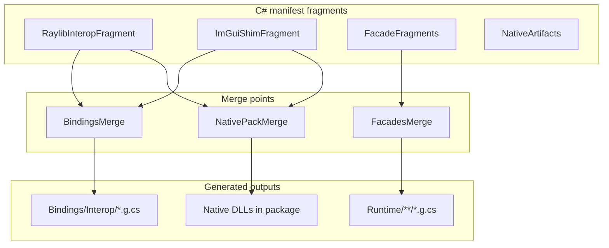

Your current setup has **several manifest shapes** (interop imports, shim exports, facades) and **several emit targets** (`Raylib6Native.g.cs`, `ImguiShimExports.g.cs`, optional Raygui). The ergonomic gap is composition: today that’s implicit across JSON files + `RaylibCodegenPipeline.GenerateBindingsOnly()`, not something you can express as “Raylib + GUI → one Bindings surface.”

Here’s a design that fits what you already have and makes merge explicit.

## Core idea: fragments + merge points

Split the problem into two concepts:

1. **Manifest fragments** — small, typed, C#-defined pieces (raylib imports, imgui shim, one façade type, native DLL ref).
2. **Merge points** — named composition steps with rules (what gets combined, into which output, how conflicts resolve).

JSON becomes an **optional compiled artifact** (for drift, agents, debugging), not the authoring surface.



---

## Layer 1: typed manifest model (not one big blob)

Mirror your existing JSON schemas as immutable records + builders:

```csharp
// Novolis.CodeGen.Bindings (shared)
public sealed record InteropFragment(
    string Id,
    string DllName,
    InteropPolicy Policy,
    IReadOnlyList<StructSpec> Structs,
    IReadOnlyList<ImportSpec> Imports);

public sealed record ShimFragment(
    string Id,
    string ModuleName,          // e.g. novolis_imgui.dll
    IReadOnlyList<ExportSpec> Exports);

public sealed record FacadeFragment(
    string Id,
    FacadeTypeSpec Type);       // Graphics, Gui, etc.

public sealed record NativeFragment(
    string Id,
    IReadOnlyList<NativeBinarySpec> Binaries);
```

Each fragment is **self-contained and addressable by `Id`**. That’s what makes merge predictable.

---

## Layer 2: fluent authoring API

Use a **two-level fluent API**: low-level fragment builders, high-level project composer.

### Fragment builders

```csharp
public static class RaylibManifests
{
    public static InteropFragmentBuilder Raylib6 => InteropFragment
        .Create("raylib6")
        .FromHeader(VendorPaths.RaylibHeader)
        .Dll("raylib")
        .Policy(p => p
            .SuppressGcTransitionByTemplate("void_void", "void_color", /* ... */)
            .NeverSuppress("MemFree", "LoadTexture")
            .FacadeMethodImpl("AggressiveInlining")
            .DisableRuntimeMarshalling())
        .Struct("Raylib6NativeImage", s => s
            .Field("Data", "nint")
            .Field("Width", "int")
            /* ... */)
        .Import("BeginDrawing", Template.VoidVoid)
        .Import("EndDrawing", Template.VoidVoid)
        /* or bulk: .ImportsFromHeader(filter) */;
}

public static class GuiManifests
{
    public static ShimFragmentBuilder ImGui => ShimFragment
        .Create("imgui")
        .Module("novolis_imgui")
        .Export("novolis_rlimgui_setup", Template.VoidInt)
        .Export("novolis_igBegin", Template.IntUtf8PtrIntInt)
        /* ... */;

    public static FacadeFragmentBuilder Gui => FacadeFragment
        .Create("gui")
        .Type("Gui", ns: "Novolis.Raylib.Gui", folder: "Gui")
        .Using("Novolis.Raylib.Interop")
        .Method("Begin", "void Begin()", body: "ImguiShimExports.novolis_rlimgui_begin_ptr()")
        /* ... */;
}
```

**Design choices that matter:**

- `Template.VoidVoid` instead of magic strings — compile-time safety, still serializes to `"void_void"`.
- `.FromHeader(...)` + `.Import(...)` can coexist: header for suggest/enrich, explicit list for authority (your current model).
- Builders return **immutable fragments** on `.Build()`.

---

## Layer 3: merge points (the important part)

Define merge as **first-class, named operations**, not ad-hoc concatenation in the pipeline.

```csharp
public sealed class BindingProject
{
    public static BindingProjectBuilder Create(string name) => new(name);
}

public sealed class BindingProjectBuilder
{
  public BindingProjectBuilder Add(params IManifestFragment[] fragments);
  public BindingProjectBuilder MergePoint(Action<MergePlanBuilder> configure);
  public BindingProject Build();
}

public sealed class MergePlanBuilder
{
  // Merge point 1: interop surface → one Bindings assembly
  public BindingsMergeBuilder Bindings(string targetNamespace = "Novolis.Raylib.Interop");

  // Merge point 2: facades → Runtime assembly tree
  public FacadesMergeBuilder Facades(string rootNamespace = "Novolis.Raylib");

  // Merge point 3: native binaries → package layout
  public NativeMergeBuilder NativePack();

  // Merge point 4: optional extensions (Raygui add-on)
  public ExtensionMergeBuilder When(bool condition, Action<MergePlanBuilder> branch);
}
```

### Example: Raylib + ImGui → one Bindings package

```csharp
var project = BindingProject.Create("Novolis.Raylib")
    .Add(
        RaylibManifests.Raylib6.Build(),
        GuiManifests.ImGui.Build(),
        RaylibManifests.Facades.Build(),   // Graphics, Window, ...
        GuiManifests.Gui.Build(),
        NativeManifests.Raylib6.Build(),
        NativeManifests.ImGuiShim.Build())
    .MergePoint(m => m
        .Bindings("Novolis.Raylib.Interop")
            .Include("raylib6", emitAs: "Raylib6Native", strategy: EmitStrategy.LibraryImport)
            .Include("imgui",  emitAs: "ImguiShimExports", strategy: EmitStrategy.DynamicExports)
            .ConflictPolicy(ConflictPolicy.FailOnDuplicateSymbol)
            .ApplyHooks(HookPhase.Interop, HookPhase.Shim)

        .Facades("Novolis.Raylib")
            .Include("raylib6.facades")
            .Include("gui")
            .AllowCrossReference()   // Gui methods can call Raylib6Native + ImguiShimExports

        .NativePack()
            .CopyToOutput("raylib6", "raylib.dll")
            .CopyToOutput("imgui", "novolis_imgui.dll")

        .When(includeRaygui, b => b
            .Bindings()
                .Include("raygui", emitAs: "RayguiShimExports", optional: true)
            .NativePack()
                .CopyToOutput("raygui", "novolis_raygui.dll")))
    .Outputs(o => o
        .Bindings("src/Novolis.Raylib.Bindings/Interop/{name}.g.cs")
        .Facades("src/Novolis.Raylib.Runtime/{folder}/{name}.g.cs")
        .SerializeManifests("codegen/pipeline/raylib6/"))   // derived JSON for drift
    .Build();
```

That replaces today’s implicit “call eight emit methods in order” with an explicit composition graph.

---

## Merge semantics (define these upfront)

Each merge point needs a **contract**:

| Merge point | Combines | Output | Conflict rule |
|-------------|----------|--------|---------------|
| **Bindings** | `InteropFragment` + `ShimFragment` | One or more `*.g.cs` partials in Bindings | Fail on duplicate C# symbol; allow duplicate native export names across DLLs |
| **Facades** | `FacadeFragment[]` | Runtime tree | Fail on duplicate method name per type |
| **NativePack** | `NativeFragment[]` | csproj `None` copy rules / nuspec | Fail on duplicate `Link=` filename unless aliased |
| **Policy** | multiple `InteropPolicy` | merged policy for shared emit | Explicit override chain (fragment → project → merge override) |
| **Hooks** | hook assemblies | post-emit Roslyn transforms | Ordered by phase + `Order` |

For “Raylib + GUI in one Bindings,” you usually want:

- **Same assembly**, **same namespace**, **different partial classes** (`Raylib6Native`, `ImguiShimExports`) — what you already do.
- Merge point only orchestrates inclusion; it does **not** flatten into one giant `Native` class (different emit strategies: `LibraryImport` vs function pointers).

Optional later merge mode:

```csharp
.Include("imgui", emitAs: "Raylib6Native", strategy: EmitStrategy.MergeIntoExisting)
```

Only when templates/DLL strategy are compatible.

---

## Where C# manifests live

Three viable patterns; pick one:

### A. Dedicated manifest project (recommended)

```
codegen/Novolis.Raylib.Manifests/
  Raylib6Interop.cs      // fragment definitions
  ImGuiShim.cs
  Facades.cs
  RaylibBindingProject.cs  // merge plan entrypoint
```

Pipeline step 06 loads `RaylibBindingProject.Build()` instead of reading JSON directly.

**Pros:** IntelliSense, refactor-safe, unit-testable merge rules.
**Cons:** One more project.

### B. Source-generated JSON from C# attributes

C# defines fragments; build emits JSON; existing emitters unchanged.

**Pros:** Minimal emitter churn.
**Cons:** Two sources of truth unless JSON is strictly derived.

### C. C# only, JSON only for drift snapshot

C# is authoritative; `SerializeManifests(...)` writes JSON + SHA256 for step_07 drift.

**Pros:** Best DX, matches your agent workflow.
**Cons:** Need to update drift step to compare derived JSON.

I'd go with **C + A**.

---

## Fluent ergonomics: `BindingSurface` as the mental model

Introduce a small DSL type users think in:

```csharp
public readonly struct BindingSurface
{
    public static BindingSurface operator +(BindingSurface left, BindingSurface right)
        => left.MergeWith(right, MergeKind.Union);

    public BindingSurface WithOptional(bool enabled) => ...;
}

// Usage
var core = BindingSurface.From(RaylibManifests.Raylib6);
var gui  = BindingSurface.From(GuiManifests.ImGui, GuiManifests.Gui);

var bindings = (core + gui)
    .IntoAssembly("Novolis.Raylib.Bindings")
    .WithNative(NativeManifests.ForWindows, NativeManifests.ForLinux);
```

Under the hood, `operator+` creates a **BindingsMerge** node in the plan graph (not immediate file IO). Execution happens when the pipeline runs `project.Emit()`.

That gives you the fluent “combine libs” feel without losing explicit merge-point semantics.

---

## Hook integration at merge points

Your existing hook model maps cleanly if hooks attach to **merge outputs**, not raw fragments:

```csharp
.MergePoint(m => m
    .Bindings()
        .Include("raylib6", "Raylib6Native")
        .AfterEmit(HookPhase.Interop, typeof(InjectXmlDocHook))
    .Facades()
        .Include("raylib6.facades")
        .AfterEmit(HookPhase.Facade, typeof(InjectEndDrawingNotifyHook)))
```

`AfterEmit` runs on each output file listed in the merge result — same as today’s phase-filtered hook loop in `WriteUnit`.

---

## Migration path from current JSON

Incremental, low risk:

1. **Model parity** — C# records mirror `RaylibManifest`, `ImguiManifest`, `FacadeManifestModels`.
2. **Import existing JSON once** — `InteropFragment.FromJson(path)` to bootstrap C# manifests from current files.
3. **Add `MergePlan` + executor** — wraps existing emitters (`RaylibInteropEmitter`, `ImguiInteropEmitter`, `FacadeEmitter`).
4. **Switch step_06** — `RaylibBindingProject.Build().Emit()` instead of hardcoded emit sequence.
5. **Keep derived JSON** — step_07 drift compares serialized output, not hand-edited JSON.

Your emitters already take manifest bytes + SHA256; they don’t care whether the bytes came from JSON on disk or C# serialization.

---

## Package layout suggestion

In `novolis-codegen`:

| Package | Contains |
|---------|----------|
| `Novolis.CodeGen.Bindings` | Fragment types, merge plan, conflict policy, serializer |
| `Novolis.CodeGen.Bindings.Fluent` | Builder extensions, `BindingSurface` sugar |
| `Novolis.CodeGen.Roslyn` | Hook host (from earlier discussion) |

In `novolis-raylib`:

| Project | Contains |
|---------|----------|
| `Novolis.Raylib.Manifests` | Raylib-specific fragment definitions + `RaylibBindingProject` |
| `Novolis.Raylib.CodeGen` | Emitters (raylib templates), raylib hooks |
| `Novolis.Raylib.Pipeline` | Steps call `RaylibBindingProject.Emit()` |

---

## Minimal interface sketch

If you want the smallest core abstraction:

```csharp
public interface IManifestFragment
{
    string Id { get; }
    FragmentKind Kind { get; }
    ManifestDocument ToDocument();  // canonical serializable form
}

public interface IMergePoint<TInput, TOutput>
{
    string Name { get; }
    MergeResult<TOutput> Merge(IReadOnlyList<TInput> inputs, MergeContext context);
}

public sealed class BindingsMergePoint : IMergePoint<IManifestFragment, BindingsEmitPlan> { ... }
public sealed class FacadesMergePoint : IMergePoint<IManifestFragment, FacadesEmitPlan> { ... }
public sealed class NativePackMergePoint : IMergePoint<IManifestFragment, NativePackPlan> { ... }
```

Pipeline execution:

```csharp
var plan = RaylibBindingProject.Create().Build();
var bindingsPlan = plan.ExecuteMerge<BindingsEmitPlan>();
foreach (var file in bindingsPlan.Files)
    Emitters.Run(file, plan.Hooks);
```

---

## What to avoid

- **One mega-manifest type** mixing interop, facades, and native — you’ll recreate today’s JSON sprawl in C#.
- **Silent auto-merge of imports** across DLLs — different calling conventions (LibraryImport vs export pointers) need explicit `EmitStrategy`.
- **Flattening everything into one `Native` class** — breaks partial regeneration and optional add-ons like Raygui.
- **Dropping SHA256/drift** — keep manifest fingerprinting per merge output file.

---

## Bottom line

Define manifests as **composable C# fragments**, and make “Raylib + GUI → one Bindings” a **`Bindings` merge point** that:

1. Includes multiple fragments with explicit emit strategies,
2. Emits co-located partial interop types in one assembly,
3. Feeds facades through a separate merge point with cross-reference enabled,
4. Serializes to JSON only as a derived artifact for drift/agents.

That gives you the fluent `core + gui` ergonomics while keeping the pipeline, hooks, and incremental step caching you already built.

If you want to go deeper next, I can sketch the exact `MergeResult` / conflict types and a full `RaylibBindingProject.cs` that reproduces your current eight manifest files 1:1 — still in Ask mode as an outline only.
