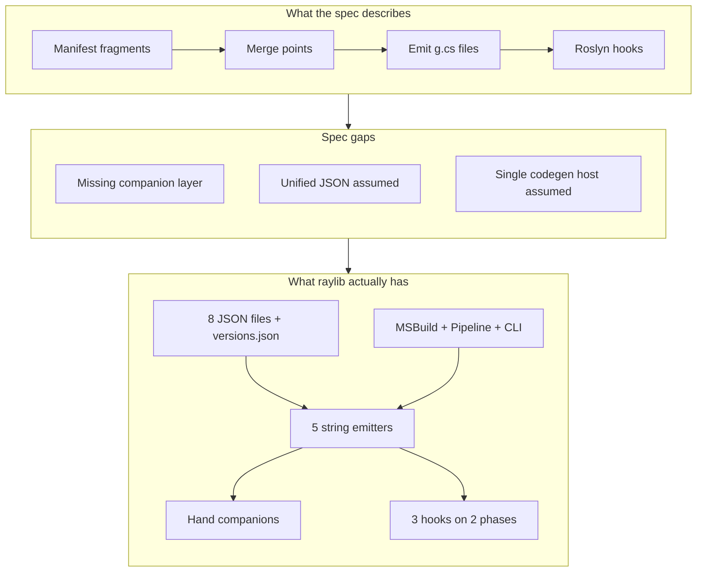
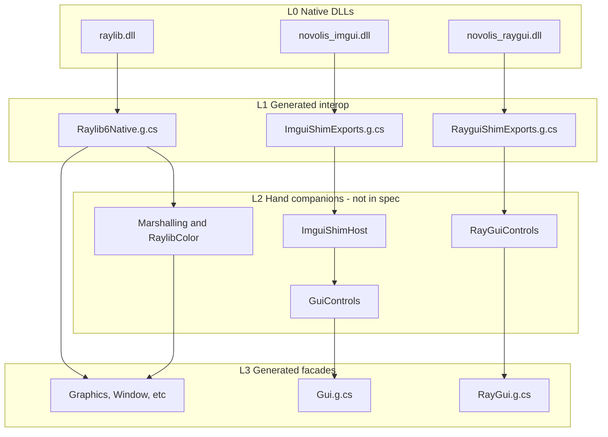
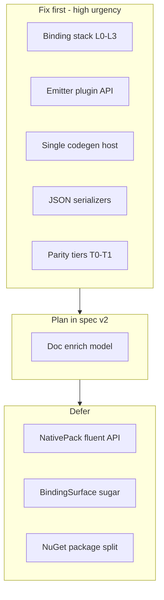
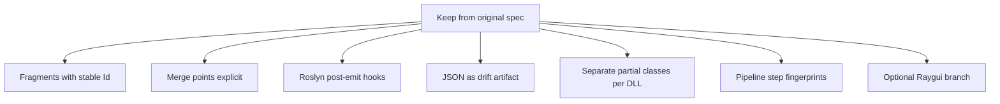
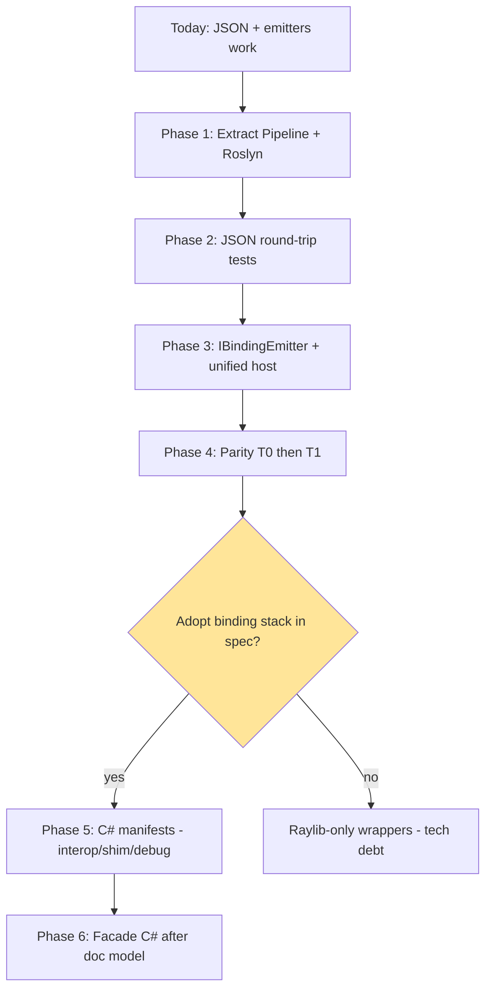
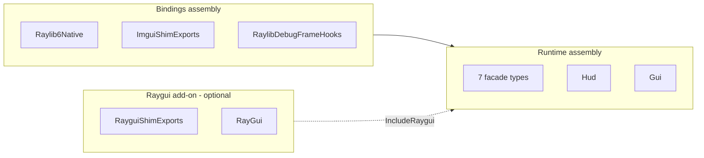

# Binding CodeGen — Analysis Summary

**Start here.** Full detail: [analysis.md](./analysis.md) · Original spec: [initial-idea.md](./initial-idea.md)

---

## One sentence

The spec’s **fragments + merge points + Roslyn hooks** shape is right, but it models a **flat** pipeline; raylib is a **stacked** pipeline with hand-written middle tiers, split JSON shapes, and three codegen entry points — fix the model before writing the library.

---

## Spec vs reality (at a glance)

| Area | Spec assumption | Reality |
|------|-----------------|---------|
| GUI binding | Façade → shim exports | Façade → **Controls** → host → shim |
| Manifests | One C# model → JSON | **3 wire formats** (`imports` / `functions` / debug) |
| Templates | Global `Template.*` | **3 disjoint** template tables + emitter extras |
| Docs | C# authoritative | JSON + **enrich writes** + hardcoded resolver defaults |
| Parity | Byte-identical emit | Tests check **SHA256 line + snippets** only |
| Codegen | Pipeline step_06 | **Pipeline + MSBuild + CLI** |

---

## The binding stack (main thing the spec missed)

Raylib core is simple (façade calls `Raylib6Native` directly). GUI paths are not.

**Takeaway:** merge points must declare **L2 companions**, not only L1 + L3.

---

## Issue heatmap (5 themes, not 20 tickets)

| Theme | Count | Severity | One-line fix |
|-------|-------|----------|--------------|
| **A. Wrong shape** — stack, JSON, templates | 3 P0 | Critical | Add L0–L3 stack + per-file serializers + scoped templates |
| **B. Library skeleton** — emitters, hosts, parity | 4 P1 | High | `IBindingEmitter`, unified host, parity T0→T1 |
| **C. Hooks & Roslyn** — context, phases, duplicate inlining | 3 P0/P1 | High | Context-only hooks; document 2 active phases |
| **D. Docs & authority** — enrich, resolver, C# manifests | 1 P0 | Medium-high | Defer façade C#; three-layer doc model |
| **E. Polish & future** — NativePack, BindingSurface, packages | 6 P2/P1 | Low | Validate-only NativePack v1; split NuGet packages |

---

## All issues — compact card view

### Must fix before library design freezes (P0)

| ID | Issue | Plug |
|----|-------|------|
| P0-1 | GUI is 4 layers, not façade→shim | `CompanionSurface` + L0–L3 stack in spec |
| P0-2 | Shim JSON ≠ interop JSON on disk | Shared C# model, **split serializers** |
| P0-3 | 3 template vocabularies + embedded structs | `InteropTemplate` / `ImGuiTemplate` / `RayguiTemplate` |
| P0-4 | Hooks read JSON from disk | Pass config via **`BindingEmitContext` only** |
| P0-5 | Enrich writes JSON; resolver has defaults | Keep JSON authoritative for façades in v1 |
| P0-6 | Byte parity too strict | Success = **T1 AST parity** (not byte-identical) |

### Fix during implementation (P1)

| ID | Issue | Plug |
|----|-------|------|
| P1-1 | Hand interop files not tracked | `RequiredCompanions` in project |
| P1-2 | NativePack is hand csproj | v1 validate paths only |
| P1-3 | Raygui optional is tri-state | Single `IncludeRaygui` precedence chain |
| P1-4 | Raygui shim namespace ≠ assembly | Explicit `EmitTarget.Namespace` |
| P1-5 | “Folders mirror names” wrong | Folder ≠ type name (World → Rendering/) |
| P1-6 | No emitter plugin API | `IBindingEmitter` + registration |
| P1-7 | 3 codegen entry points | `IBindingCodegenHost` |
| P1-8 | Hooks on ImGui/Debug unused | Document; only Interop + Facade today |
| P1-9 | Inlining in emitter **and** hook | Keep emitter for parity (option A) |

### Can wait (P2)

NativePack generator · `BindingSurface` presets · separate Source vs Codegen project · shim export verify · drift profiles · NuGet dependency split · semantic validation layers.

---

## What still holds from the original spec

Do **not** throw away: fragment IDs, merge points, hook pipeline, “don’t flatten LibraryImport + dynamic exports into one class.”

---

## Recommended path (visual)

| Phase | Outcome | Blocks on |
|-------|---------|-----------|
| 1 | Shared pipeline kernel | — |
| 2 | Proves manifest model | — |
| 3 | Library can orchestrate raylib emitters | P2 |
| 4 | Safe to swap step_06 | P3 |
| 5 | C# authoring (partial) | **P0-1 stack + P0-5 docs** |
| 6 | Full C# façades | Enrich/resolver decision |

---

## Parity scope (14 generated files)

**Out of parity diff:** all hand-written `.cs` (companions, shell, presentation hooks).

---

## Decisions to make next (pick 1–2)

| # | Question | Options |
|---|----------|---------|
| 1 | Binding stack in spec v2? | **Yes (recommended)** / defer |
| 2 | Parity bar | **T1 AST** / T0 headers only / T2 byte |
| 3 | Façade authority in v1 | **JSON** / C# |
| 4 | First library deliverable | **Pipeline extract** / Bindings model / Roslyn host |

---

## Document map

| File | Role |
|------|------|
| [initial-idea.md](./initial-idea.md) | Original design (read-only baseline) |
| [initial-idea-v2.md](./initial-idea-v2.md) | **Implementation spec** (L0–L3, APIs, parity) |
| **summary.md** (this file) | Visual overview + priorities |
| [analysis.md](./analysis.md) | Full evidence, code references, plug details |

When a plug is accepted, record it in **initial-idea-v2.md** — not by editing the baseline spec until sign-off.
